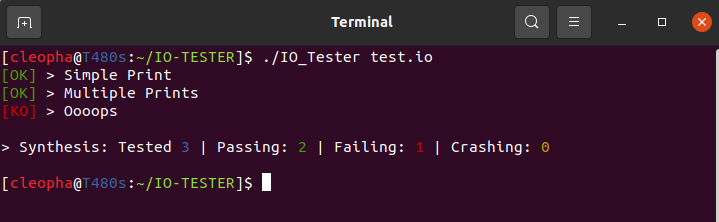
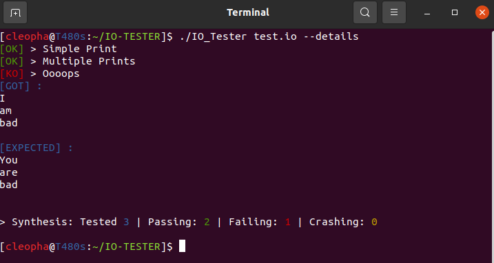
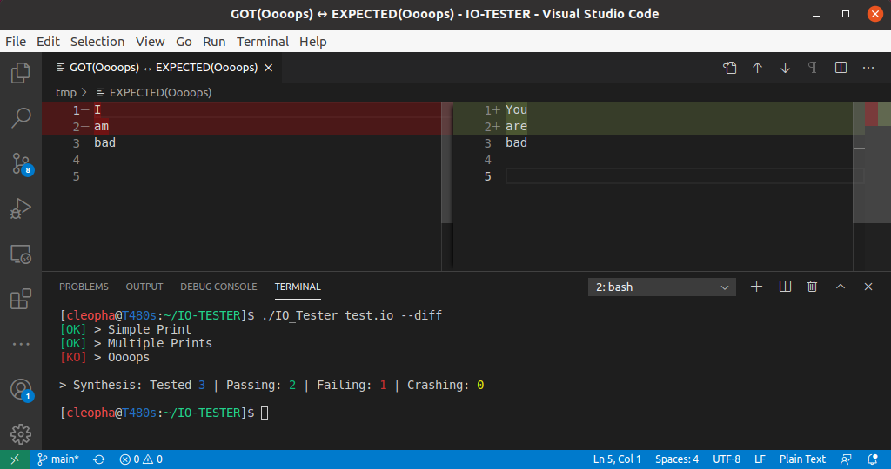

# IO-Tester
<a href="https://github.com/tocola/IO-TESTER"></a>

## What is IO-Tester

The goal of this software is to take files as parameter that contains lists of inputs and expected ouputs and to tell the user if the tests succeed, failed or crashed.

### Compatibility
Tested on `MacOS`, `Ubuntu`, `Fedora`, `ArchLinux`

## How to use it ?

1. Need to have ```VSCode```
2. Clone our repository
3. Go to the ```project``` folder
4. Execute the followind command ```sudo make install``` (the binary will be installed at ***usr/local/bin***)
5. Now let's write your test !

## Usage

Write the following file:
```sh
[NameOfTest] CommandRunYourProgram
theOutputYouWant
[END]
```

Here we test a program that takes parameters and prints them in the standard output.  
In file ```test.io```

```sh
[Simple Print] ./printer test
test

[END]

[Multiple Prints] ./printer Hello World !
Hello
World
!

[END]

[Oooops] ./printer I am bad
You
are
bad

[END]
```

### Execute

```sh
USAGE:
	./IO_Tester test.io [OPTIONS]

DESCRIPTION:
	test.io	            file when contains functional tests

OPTIONS:
	-h --help           Display this help
	-v --version	    Display this version
	-c --changelog	    Display this changelog
	-u --update	    Update this programm (sudo)
	--details	    Display details of all tests
	--diff		    Display difference in VSCode
```

  
  
  

You can also run multiple test files at once :
```sh
IO_Tester test1.io test2.io test3.io --diff
```

## Annexe
If you want to uninstall IO-Tester run:  
```make uninstall```


If you want just have binary run:  
```make```


If you want remove all .o in folder run:  
```make clean```


If you want remove .o and binary run:  
```make fclean```


## Contributors

 - [Benjamin Reigner](https://github.com/Breigner01)
 - [Alexandre Chetrit](https://github.com/chetrit)
 - [Coline Seguret](https://github.com/Cleopha)
