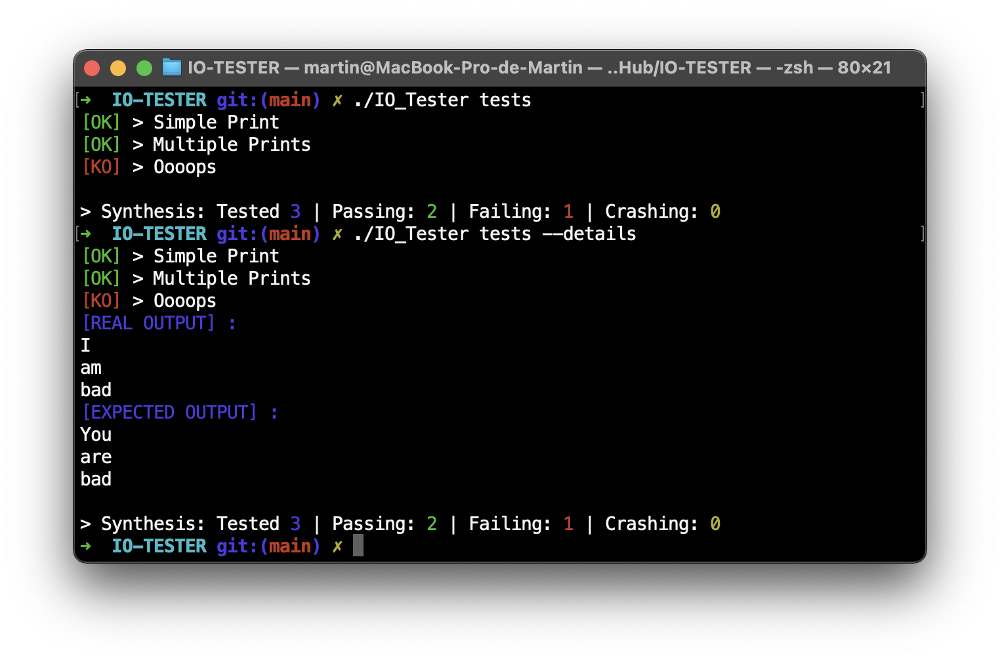

# IO-Tester
The goal of this software is to take a file as parameter that contains lists of inputs and expected ouputs and to tell the user if the test succeed, failed or crashed.

# Installation
After cloning the repository :
```
make
```
After that you will be able to grab `IO_Tester` at the root of this project.

# Usage

Lets say we want to test that program :
```c
// main.c

#include <stdio.h>

int main(int ac, char **av)
{
    for (int i = 1; i < ac; i++)
        printf("%s\n", av[i]);
    return 0;
}
```
First lets compile it :
```sh
gcc main.c -o printer
```
Then prepare your tests in a file with this patern :
```
[Simple Print] ./printer test
test
[END]

[Multiple Prints] ./printer Hello World !
Hello
World
!
[END]

[Oooops] ./printer I am bad
You
are
bad
[END]
```
Then execute `IO_Tester` with the file containing the tests as first argument. You can add `-d` or `--details` as second argument to display the real and the expected output when a test fails.
