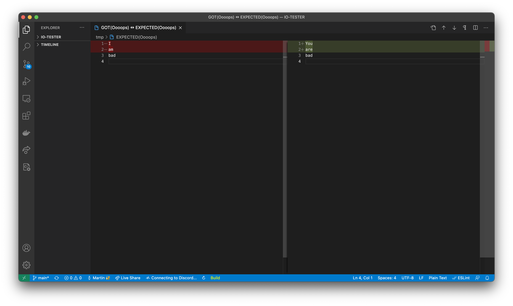

# IO-Tester
<a href="https://github.com/tocola/IO-TESTER"></a>

The goal of this software is to take files as parameter that contains lists of inputs and expected ouputs and to tell the user if the tests succeed, failed or crashed.

# Compatibility
Tested on `MacOS`, `Ubuntu`, `Fedora`

# Installation
After cloning the repository enter the following command :
```
sudo make install
```
`IO_Tester` will be installed at usr/local/bin.

# Usage

Lets say we want to test that program :
```c
// main.c

#include <stdio.h>

int main(int ac, char **av)
{
    for (int i = 1; i < ac; i++)
        printf("%s\n", av[i]);
    return 0;
}
```
First lets compile it :
```sh
gcc main.c -o printer
```
Then prepare your tests in a file with this patern :
```
[Simple Print] ./printer test
test

[END]

[Multiple Prints] ./printer Hello World !
Hello
World
!

[END]

[Oooops] ./printer I am bad
You
are
bad

[END]
```
Then execute `IO_Tester` with the file containing the tests as argument.

You can add `--details` as final argument to display the real and the expected output when a test fails.

You can add `--diff` as final argument to display the diff between the real and the expected output in VS Code when a test fails.

You can also run multiple test files at once :
```sh
IO_Tester test1 test2 test3 --diff
```
## Contributors

 - [Benjamin Reigner](https://github.com/Breigner01)
 - [Alexandre Chetrit](https://github.com/chetrit)
